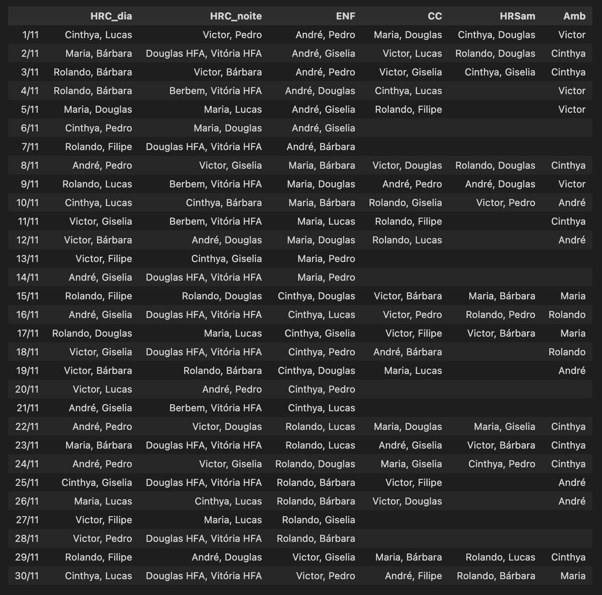

# Agendador de escala

Trabalho final da disciplina "Pesquisa Operacional" do Programa de Pós Graduação em Informática da Universidade de Brasília.
O objetivo é a construção de um sistema para a organização automática da escala dos residentes de cirurgia do Hospital Regional da Ceilândia (HRC).

A saída do algoritmo é a escala do mês especificado:



## Instalação e uso

Install python
```
sudo apt-get update
sudo apt-get install python3.6
```

Create a virtual environment called "venv" and activate it
```
python3 -m venv venv
source venv/bin/activate
```

Install the required packages
```
python3 -m pip install -r requirements.txt
```

Run 
```
python3 recognizer.py
```